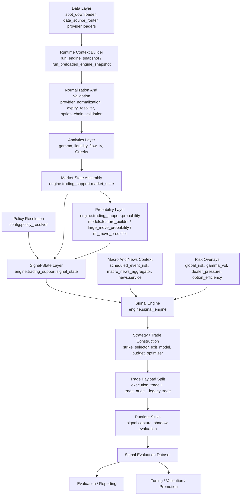
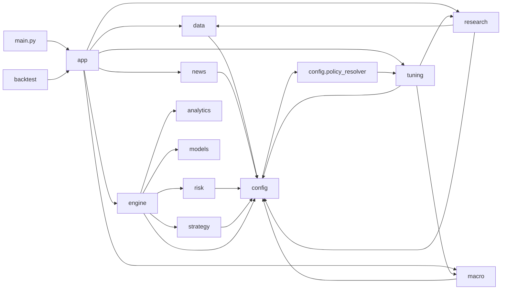
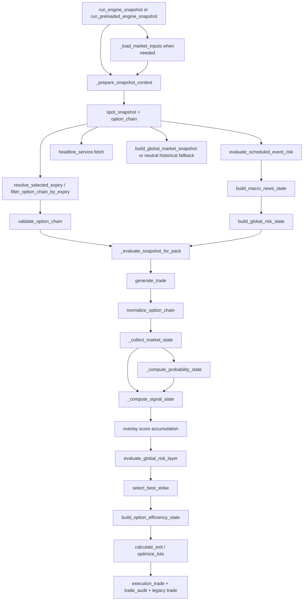
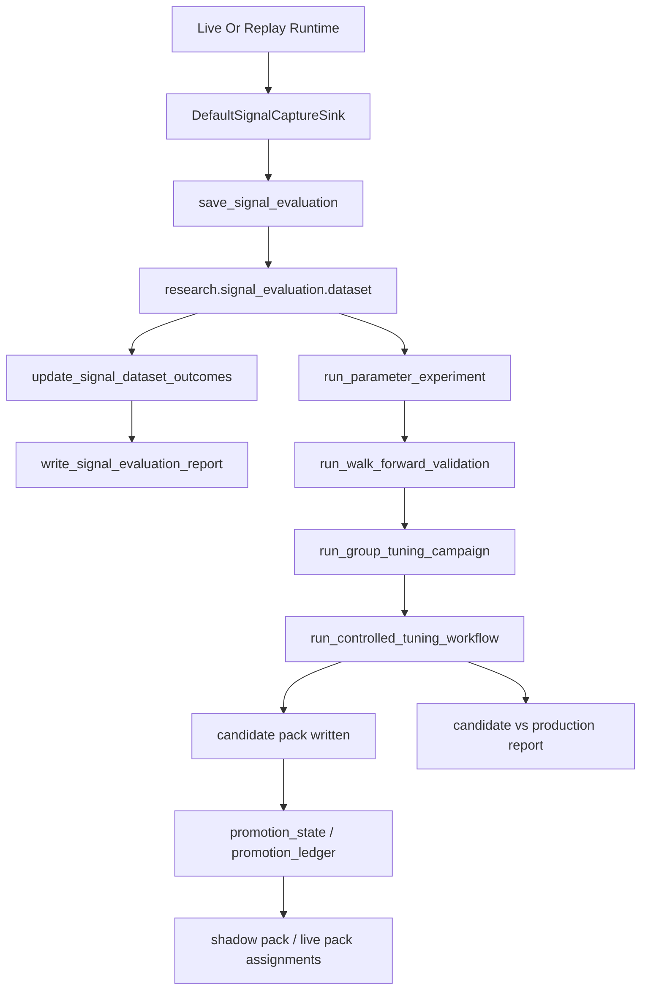
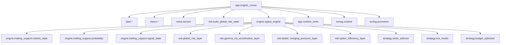

# Dependency Diagrams

The diagrams below are based on the code paths and import relationships observed in the repository.

## 1. High-Level Architecture

This is the architecture the live runtime follows most closely.

## 2. Folder Dependency Diagram

The key architectural wrinkle is now localized: configuration remains dynamically parameter-pack aware, but that dependency is isolated behind `config.policy_resolver` rather than routed through the full tuning runtime/registry stack.

## 3. Data-To-Signal Pipeline

This is the real production signal path as implemented today.

## 4. Research / Tuning / Promotion Workflow

The research dataset is the bridge between production signal generation and governed tuning.

## 5. Candidate-Vs-Production Parameter Workflow

```mermaid
flowchart LR
    A[config/* policy defaults] --> B[tuning.registry]
    B --> C[tuning.packs]
    C --> D[config.policy_resolver active context]
    D --> E[config getters resolve live overrides]
    E --> F[app.engine_runner]
    F --> G[engine.signal_engine]

    H[run_controlled_tuning_workflow] --> I[run_group_tuning_campaign]
    I --> J[run_parameter_experiment]
    J --> K[candidate overrides]
    K --> L[materialize_candidate_parameter_pack]
    L --> M[promotion_state candidate]
    M --> N[shadow mode in runtime]
    N --> O[DefaultShadowEvaluationSink]
    O --> P[shadow log and comparison]
    P --> Q[promote_candidate]
    Q --> R[promotion_state live]
    R --> D
```

This diagram shows the closed loop between configuration, runtime parameter activation, tuning, shadow evaluation, and eventual promotion.

## 6. Central-Module Dependency Diagram

This is the smallest useful picture of the runtime center of gravity in the repository.

## Diagram Notes

- The production core is centered on `app.engine_runner` and `engine.signal_engine`.
- The computational core is cleaner than the operational boundary around it.
- The tuning/configuration loop is still the highest-coupling boundary, but the production policy-resolution path is cleaner because it now terminates at `config.policy_resolver`.
